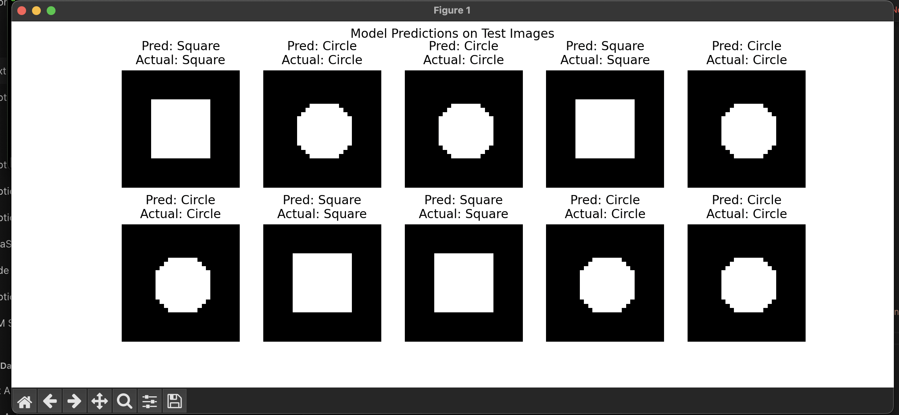

# pheature



---

**Feature Extraction Fundamentals: How to Identify and Engineer Key Features Using Simple Shapes**

---

Feature extraction is the secret sauce of machine learning. It's where we take raw data—often messy, complex, and overwhelming—and distill it down to the key elements that make a difference. For images, it’s about pulling out the features that make sense of the visuals: edges, shapes, colors, and textures. But in this blog post, we’ll keep it simple. We’re working with synthetic shapes like circles, squares, and triangles, the building blocks of visual learning.

Why start with simple shapes? Because they’re perfect for understanding the essentials of feature extraction without getting lost in the noise. Circles, squares, and triangles don’t distract with intricate details; they’re all about form, structure, and clarity. And once you know how to identify and engineer features from these shapes, you’ve got the basics to tackle more complex images.

---

### The Basics: What Are Features, Really?

In machine learning, features are the signals in the noise—the aspects of data that matter to the model. Think of them as clues that tell the model what it’s looking at. In text, features might be word frequencies or patterns; in structured data, columns and values. But in images, we’re often looking at edges, shapes, textures, and colors. 

With shapes, the edges and corners tell us almost everything we need to know. Circles have smooth, continuous edges, while squares and triangles come with sharp angles and corners. These differences are features, and they’re what let a model “see” the distinctions.

---

### How to Spot Key Features in Shapes

When we look at synthetic shapes, we're after three main elements: edges, corners, and overall structure.

1. **Edges and Corners**: An edge is where one part of an object ends, and another begins. It’s the boundary, the line that defines a shape’s form. Corners are points where two edges meet. With simple shapes, corners can tell us a lot—circles don’t have any, squares have four, and triangles three. These differences are fundamental.

2. **Shape Descriptors**: Shape descriptors tell us about the overall form. For example, circles are smooth with no abrupt angles. Triangles, by contrast, are all sharp points. A model can distinguish these shapes by learning to “see” these descriptors, just like our brains do. 

3. **Filters for Detecting Features**: In machine learning, filters help models find these edges and corners. Convolutional filters, for example, work like a set of glasses that highlight specific visual elements. Edge detection filters like Sobel and Canny are common for detecting the sharp changes that form edges, making them a perfect tool for spotting the outlines of shapes.

---

### Building Effective Features: Crafting Data for Learning

Now that we know what features to look for, the next step is feature engineering—transforming raw data into the most informative form for a model. 

- **Scaling and Normalization**: Standardizing the size and scale of shapes ensures that a model isn’t thrown off by differing dimensions. Resizing all shapes to the same scale is a quick way to keep things uniform.
- **Edge and Corner Detection**: Edge detection isolates the borders of shapes, and corner detection pinpoints their key points. Together, they allow a model to distinguish a circle from a square or triangle quickly.

Feature engineering boils down to emphasizing the clues that matter most, making it easier for the model to focus on what’s relevant.

---

### Selecting Features: What Matters Most?

Feature selection is all about choosing the most valuable features. If a model can learn the difference between shapes based on corners alone, then perhaps we don’t need complex filters to detect textures or fine details.

To test the value of a feature, we can try training a model with and without that feature and see how performance changes. For example, if we train a model to recognize squares using just edge detection, we might get decent results. Add corner detection, though, and the model will get better at differentiating a square from a circle. This process is key to ensuring we’re not just adding features for the sake of complexity but focusing on the ones that make a real difference.

---

### Bringing It All Together with Simple Visualizations


One of the best ways to understand feature extraction is by visualizing feature maps—images that show which features the model focuses on. When working with simple shapes, these maps reveal how edge detection highlights boundaries, or how corner detection pinpoints key points of interest. For beginners, seeing feature maps in action helps clarify the purpose of feature extraction and shows exactly what the model “sees.”

---

### Practical Examples Using Synthetic Shapes


Let’s make it concrete with some examples:

- **Identifying Circles, Squares, and Triangles**: Using edge and corner detection, a basic model can easily distinguish between shapes. Corners give away squares and triangles; circles, meanwhile, stand out as having no corners at all.
  
- **Combining Filters with Simple CNNs**: Convolutional neural networks (CNNs) use filters to process images in layers. By running synthetic shapes through a CNN, you can see how different layers pick up on edges, corners, and textures, progressively building a clearer “understanding” of each shape.

With synthetic shapes, you don’t need complex datasets or high-powered machines to see the basics of feature extraction. Simple tools, clear data, and a well-structured model get the job done.

---

### Essential Tools for Feature Engineering

Getting started with feature extraction is easy with tools like **Scikit-Image** and **OpenCV** for basic image processing, and **TensorFlow** or **PyTorch** for building CNNs. Scikit-Image and OpenCV make it easy to apply edge detection and other filters, while TensorFlow and PyTorch are great for experimenting with convolutional layers that process shapes step-by-step.

For beginners, using these libraries opens up a hands-on way to learn feature extraction, helping you visualize each step and see how small tweaks change the output.

---

### Key Takeaways and Next Steps

Feature extraction doesn’t have to be complicated. By focusing on the basics with synthetic shapes, you can build a solid understanding of what makes a good feature and how it helps a model learn. Start by experimenting with edge and corner detection on simple shapes, and then try building up to more complex features. Once you get the hang of it, these foundational skills will transfer seamlessly to larger, more complex datasets.

### FULL CODE

```python
import torch
import torch.nn as nn
import pytorch_lightning as pl
from torch.utils.data import DataLoader, TensorDataset
from torchvision import transforms
import numpy as np
import matplotlib.pyplot as plt

# Step 1: Generate synthetic shape data
def generate_shapes(n_samples=100, img_size=28):
    print("\n[INFO] Generating synthetic shape data...")
    images, labels = [], []
    for _ in range(n_samples):
        img = np.zeros((img_size, img_size), dtype=np.float32)
        shape_type = np.random.randint(2)
        if shape_type:  # Circle
            rr, cc = np.ogrid[:img_size, :img_size]
            mask = (rr - img_size // 2) ** 2 + (cc - img_size // 2) ** 2 < (img_size // 4) ** 2
            img[mask] = 1.0
        else:  # Square
            img[img_size // 4: -img_size // 4, img_size // 4: -img_size // 4] = 1.0
        images.append(img)
        labels.append(shape_type)
    print(f"[INFO] Generated {n_samples} images (0 = square, 1 = circle).")
    return torch.tensor(images).unsqueeze(1), torch.tensor(labels)

# Step 2: Define the CNN model
class ShapeClassifier(pl.LightningModule):
    def __init__(self):
        super().__init__()
        print("[INFO] Initializing the CNN model for shape classification...")
        self.model = nn.Sequential(
            nn.Conv2d(1, 8, 3, 1), nn.ReLU(), nn.MaxPool2d(2),
            nn.Conv2d(8, 16, 3, 1), nn.ReLU(), nn.Flatten(),
            nn.Linear(16 * 11 * 11, 2)
        )
    
    def forward(self, x):
        return self.model(x)
    
    def training_step(self, batch, _):
        x, y = batch
        preds = self(x)
        loss = nn.CrossEntropyLoss()(preds, y)
        acc = (preds.argmax(dim=1) == y).float().mean()
        self.log("train_loss", loss, prog_bar=True)
        self.log("train_acc", acc, prog_bar=True)
        return loss

    def configure_optimizers(self):
        print("[INFO] Configuring the optimizer...")
        return torch.optim.Adam(self.parameters(), lr=0.001)

# Step 3: Prepare the data
print("[INFO] Preparing the training data...")
x_train, y_train = generate_shapes(500)
train_loader = DataLoader(TensorDataset(x_train, y_train), batch_size=32, shuffle=True)
print("[INFO] Data loaded. Training data contains 500 samples.")

# Step 4: Train the model
print("\n[INFO] Starting model training...")
model = ShapeClassifier()
trainer = pl.Trainer(max_epochs=5, enable_checkpointing=False, logger=False)

print("\n[TRAINING] Model training in progress...\n")
trainer.fit(model, train_loader)
print("[TRAINING COMPLETE] Model finished training.")

# Step 5: Test model performance and visualize predictions
print("\n[TESTING] Evaluating model on new data...")
x_test, y_test = generate_shapes(10)
model.eval()  # Set the model to evaluation mode

# Perform predictions and visualize
with torch.no_grad():
    preds = model(x_test).argmax(dim=1)

    # Plot test images with predictions
    fig, axes = plt.subplots(2, 5, figsize=(12, 5))
    fig.suptitle("Model Predictions on Test Images")
    for i, ax in enumerate(axes.flat):
        ax.imshow(x_test[i][0], cmap="gray")
        pred_label = "Circle" if preds[i].item() == 1 else "Square"
        actual_label = "Circle" if y_test[i].item() == 1 else "Square"
        ax.set_title(f"Pred: {pred_label}\nActual: {actual_label}")
        ax.axis("off")
    plt.show()

# Final summary of accuracy
correct = (preds == y_test).sum().item()
accuracy = correct / len(y_test) * 100
print(f"\n[SUMMARY] Model Accuracy on Test Set: {accuracy}% ({correct}/{len(y_test)} correct predictions)")
print("[DEMO COMPLETE] Check the visualization above for model predictions.")

```
